# VELTRIX SPORTS - DIAGRAMS INDEX
## Visual Documentation

---

# DIAGRAMS OVERVIEW

| # | Diagram | File | Size | Description |
|---|---------|------|------|-------------|
| 1 | System Architecture | `01_system_architecture.png` | 140 KB | Overall system design |
| 2 | Database ER Diagram | `02_database_er.png` | 187 KB | Database relationships |
| 3 | Authentication Flow | `03_authentication_flow.png` | 107 KB | Login/Register flow |
| 4 | Training Plan Flow | `04_training_plan_flow.png` | 114 KB | Plan creation & tracking |
| 5 | Event Registration | `05_event_registration_flow.png` | 92 KB | Event signup process |
| 6 | Payment Flow | `06_payment_flow.png` | 122 KB | Payment processing |
| 7 | Device Sync Flow | `07_device_sync_flow.png` | 91 KB | Device integration |
| 8 | Feature Modules | `08_feature_modules.png` | 182 KB | App feature breakdown |
| 9 | API Endpoints | `09_api_endpoints.png` | 114 KB | API structure |
| 10 | Screen Navigation | `10_screen_navigation.png` | 115 KB | Screen flow |
| 11 | Data Flow | `11_data_flow.png` | 111 KB | Data movement |
| 12 | Deployment Architecture | `12_deployment_architecture.png` | 90 KB | AWS deployment |

---

# 1. SYSTEM ARCHITECTURE

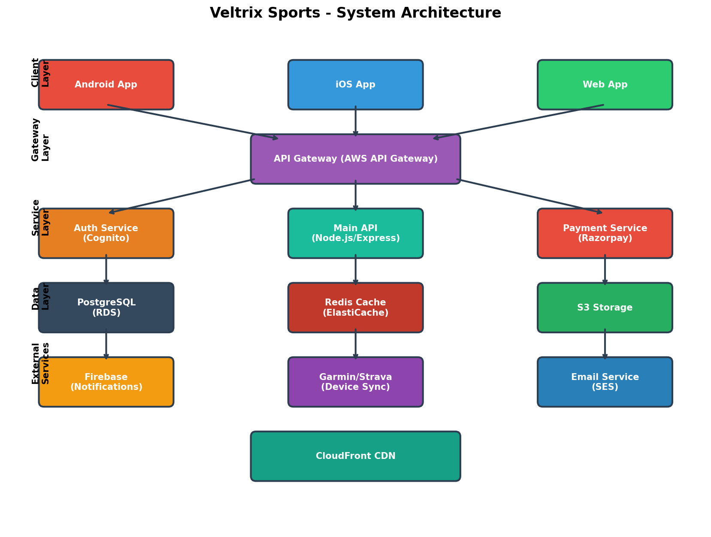

## Description
Shows the complete system architecture including:
- **Client Layer**: Android, iOS, Web apps
- **Gateway Layer**: AWS API Gateway
- **Service Layer**: Auth, Main API, Payment services
- **Data Layer**: PostgreSQL, Redis, S3
- **External Services**: Firebase, Garmin/Strava, Email

## Key Components
| Layer | Components | Purpose |
|-------|------------|---------|
| Client | Flutter Apps | User interface |
| Gateway | API Gateway | Request routing |
| Service | Node.js API | Business logic |
| Data | PostgreSQL | Data storage |
| Cache | Redis | Performance |
| Storage | S3 | File storage |

---

# 2. DATABASE ER DIAGRAM

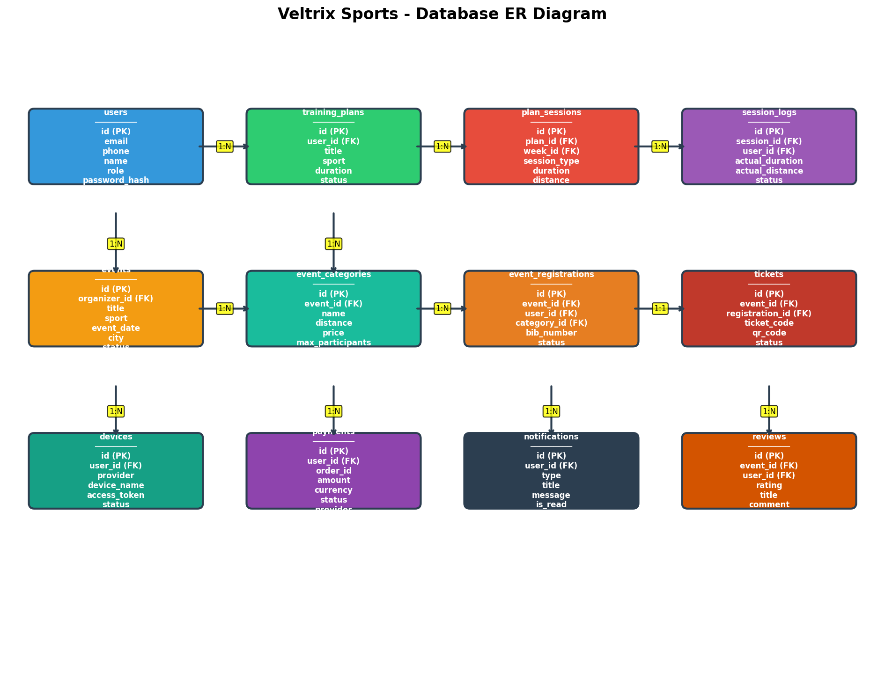

## Description
Shows all database tables and their relationships:
- **users** - User accounts
- **training_plans** - Workout plans
- **plan_sessions** - Individual sessions
- **session_logs** - Completed sessions
- **events** - Sports events
- **event_categories** - Event types
- **event_registrations** - Signups
- **tickets** - Purchased tickets
- **devices** - Connected devices
- **payments** - Transactions
- **notifications** - User alerts
- **reviews** - Event ratings

## Relationships
| From | To | Type | Description |
|------|-----|------|-------------|
| users | training_plans | 1:N | User has many plans |
| training_plans | plan_sessions | 1:N | Plan has many sessions |
| plan_sessions | session_logs | 1:N | Session has many logs |
| users | events | 1:N | Organizer has many events |
| events | event_categories | 1:N | Event has many categories |
| events | event_registrations | 1:N | Event has many registrations |
| users | devices | 1:N | User has many devices |
| users | payments | 1:N | User has many payments |

---

# 3. AUTHENTICATION FLOW

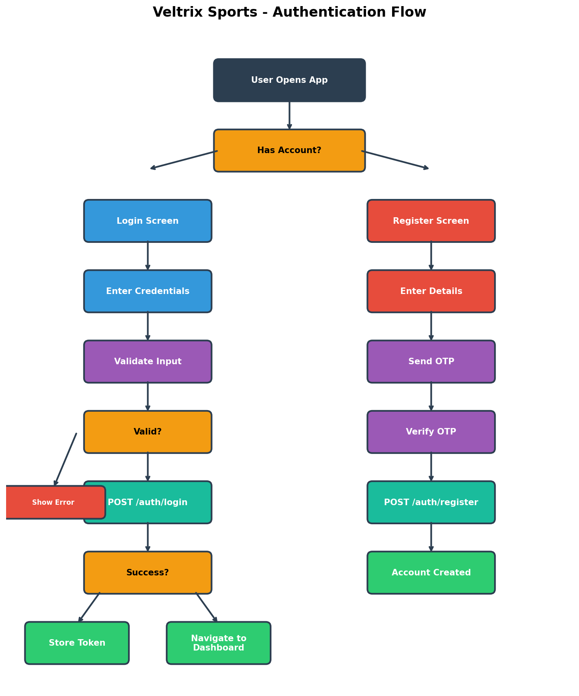

## Description
Shows the complete authentication process:
1. User opens app
2. Choice: Login or Register
3. Login: Enter credentials → Validate → API call → Store token
4. Register: Enter details → Send OTP → Verify → Create account

## Flow Steps
```
┌─────────────┐
│  Open App   │
└──────┬──────┘
       │
       ▼
┌─────────────┐
│ Has Account?│
└──────┬──────┘
       │
   ┌───┴───┐
   │       │
   ▼       ▼
┌─────┐ ┌─────┐
│Login│ │Reg. │
└──┬──┘ └──┬──┘
   │       │
   ▼       ▼
┌─────────────────┐
│ Validate Input  │
└────────┬────────┘
         │
         ▼
┌─────────────────┐
│  API Request    │
└────────┬────────┘
         │
     ┌───┴───┐
     │       │
     ▼       ▼
┌────────┐ ┌────────┐
│Success │ │ Error  │
└───┬────┘ └───┬────┘
    │          │
    ▼          ▼
┌────────┐ ┌────────┐
│Dashboard│ │Show    │
└────────┘ │Error   │
           └────────┘
```

---

# 4. TRAINING PLAN FLOW

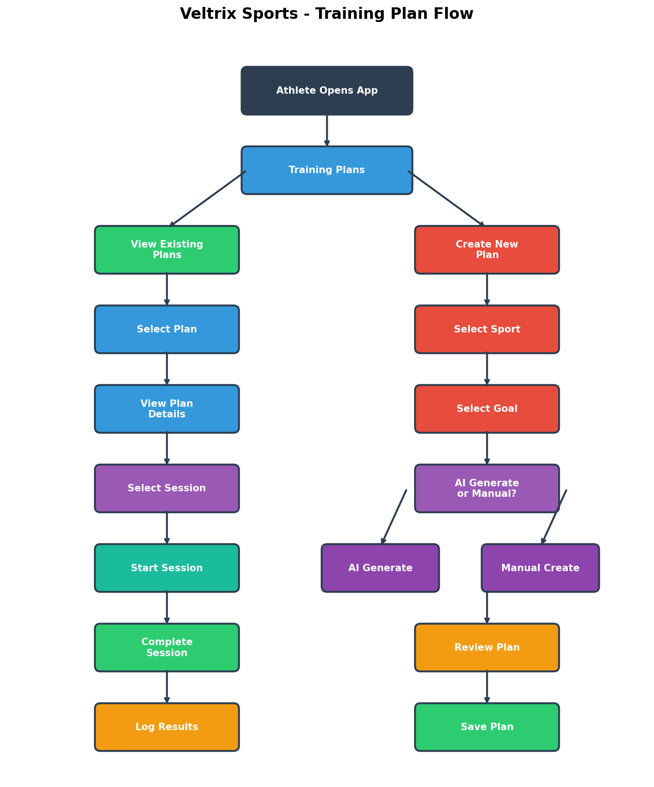

## Description
Shows how athletes create and follow training plans:
1. View existing plans OR Create new plan
2. View Plan → Select Session → Start → Complete → Log Results
3. Create Plan → Select Sport/Goal → AI or Manual → Review → Save

## Two Paths
| Path | Steps | Outcome |
|------|-------|---------|
| View Plan | Select → View → Session → Start → Complete | Log results |
| Create Plan | Sport → Goal → Generate → Review → Save | New plan |

---

# 5. EVENT REGISTRATION FLOW

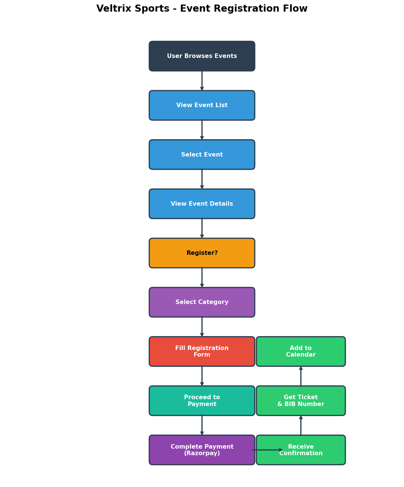

## Description
Shows how users register for events:
1. Browse events
2. Select event
3. View details
4. Select category
5. Fill registration form
6. Complete payment
7. Receive confirmation & ticket

## Registration Steps
```
Browse → Select → View → Register → Pay → Confirm
  │        │        │        │        │       │
  ▼        ▼        ▼        ▼        ▼       ▼
List    Event    Details  Form    Razorpay  Ticket
```

---

# 6. PAYMENT FLOW

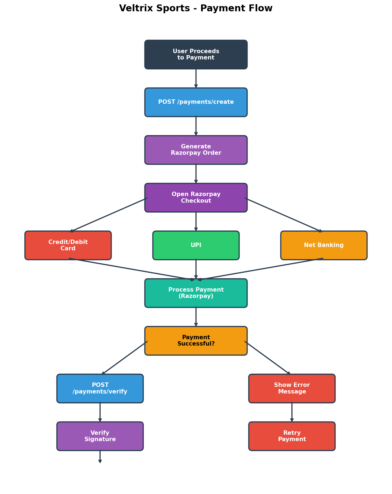

## Description
Shows the complete payment process:
1. User proceeds to payment
2. Create Razorpay order
3. Open Razorpay checkout
4. User selects payment method
5. Process payment
6. Verify signature
7. Capture payment
8. Send confirmation
9. Generate ticket

## Payment Methods
- Credit/Debit Card
- UPI
- Net Banking

## Security
- Razorpay signature verification
- Idempotency keys
- Transaction logging

---

# 7. DEVICE SYNC FLOW

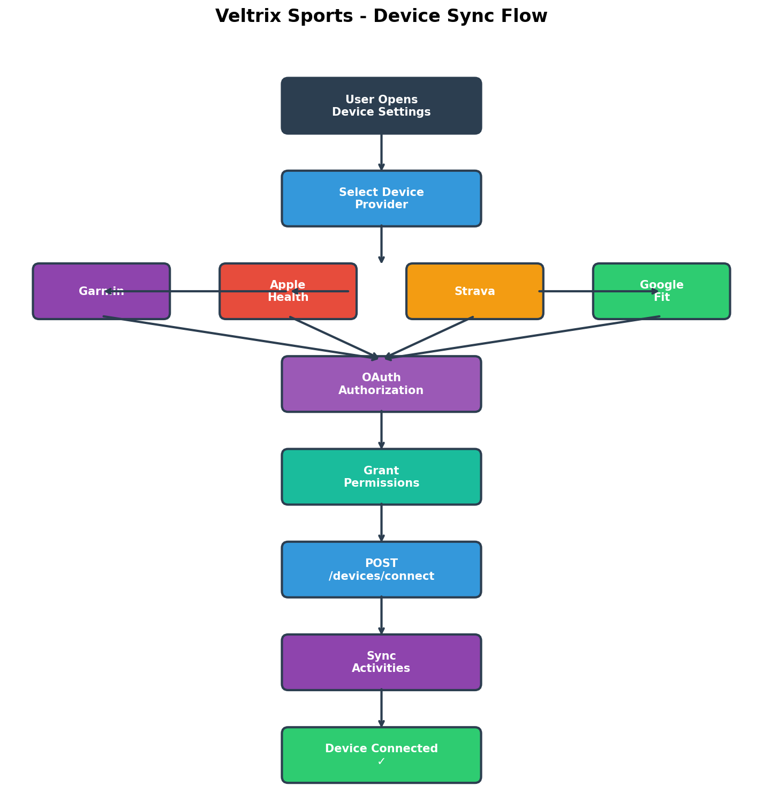

## Description
Shows how users connect fitness devices:
1. Open device settings
2. Select provider (Garmin, Apple Health, Strava, Google Fit)
3. OAuth authorization
4. Grant permissions
5. Connect device
6. Sync activities
7. Device connected

## Supported Devices
| Device | Provider | Data Synced |
|--------|----------|-------------|
| Garmin | Garmin Connect | Activities, Heart Rate |
| Apple Watch | Apple Health | Workouts, Health Data |
| Strava | Strava API | Activities, Routes |
| Wear OS | Google Fit | Activities, Health Data |

---

# 8. FEATURE MODULES

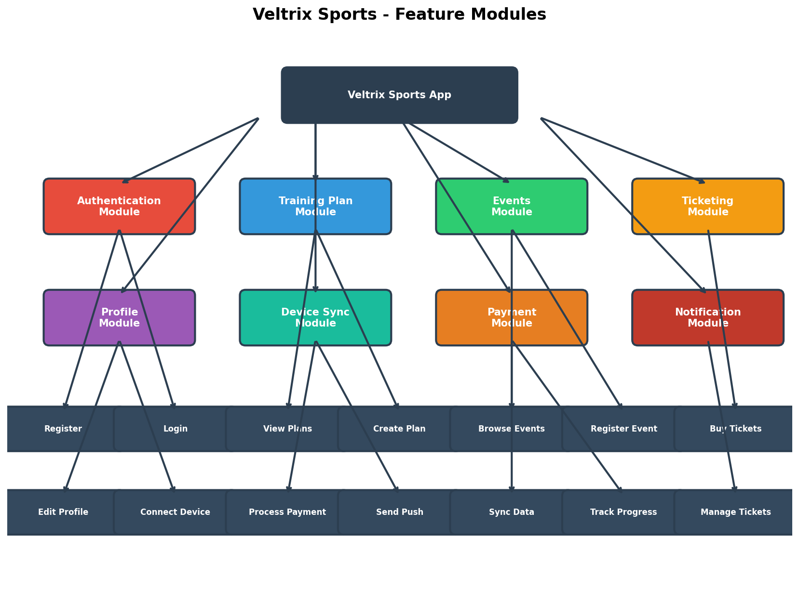

## Description
Shows all app modules and their features:
- **Authentication Module**: Register, Login
- **Training Plan Module**: View Plans, Create Plan
- **Events Module**: Browse Events, Register Event
- **Ticketing Module**: Buy Tickets, Manage Tickets
- **Profile Module**: Edit Profile, Settings
- **Device Sync Module**: Connect Device, Sync Data
- **Payment Module**: Process Payment, History
- **Notification Module**: Push Notifications, Alerts

## Module Breakdown
| Module | Features | Priority |
|--------|----------|----------|
| Authentication | Register, Login, OTP | P0 |
| Training | Plans, Sessions, Progress | P0 |
| Events | Browse, Register, My Events | P0 |
| Tickets | Buy, View, Check-in | P1 |
| Profile | Edit, Devices, Settings | P1 |
| Payments | Process, Verify, History | P0 |
| Notifications | Push, Email, SMS | P1 |

---

# 9. API ENDPOINTS

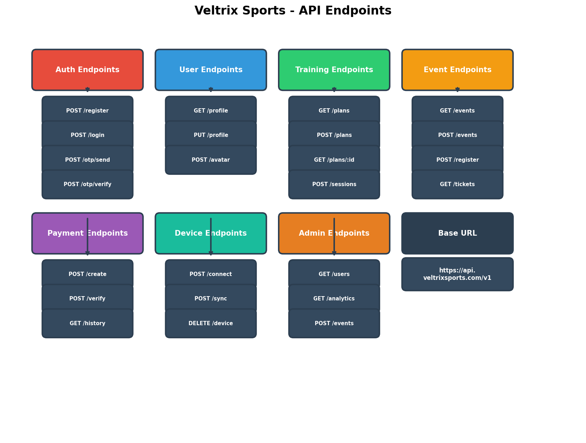

## Description
Shows all API endpoints organized by module:
- **Auth**: register, login, otp/send, otp/verify
- **User**: profile, update, avatar
- **Training**: plans, sessions, progress
- **Events**: list, create, register
- **Payments**: create, verify, history
- **Devices**: connect, sync, disconnect
- **Admin**: users, analytics, events

## Base URL
```
https://api.veltrixsports.com/v1
```

## Endpoint Count
| Module | Endpoints | Methods |
|--------|-----------|---------|
| Auth | 4 | POST |
| User | 3 | GET, PUT, POST |
| Training | 4 | GET, POST |
| Events | 4 | GET, POST |
| Payments | 3 | POST, GET |
| Devices | 3 | POST, DELETE |
| Admin | 3 | GET, POST |
| **Total** | **24** | |

---

# 10. SCREEN NAVIGATION

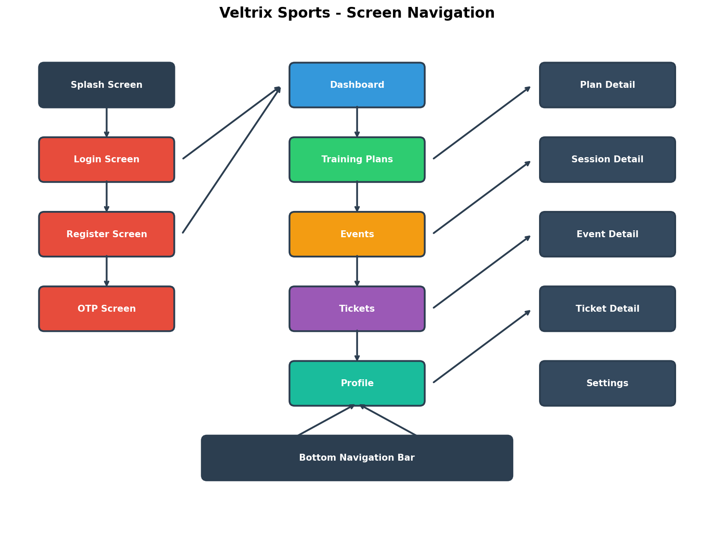

## Description
Shows all screens and navigation flow:
- **Auth Screens**: Splash, Login, Register, OTP
- **Main Screens**: Dashboard, Training, Events, Tickets, Profile
- **Detail Screens**: Plan Detail, Session Detail, Event Detail, Ticket Detail, Settings
- **Bottom Nav**: 5 main tabs

## Navigation Structure
```
Splash
  │
  ▼
Login ──► Register ──► OTP
  │
  ▼
Dashboard
  │
  ├──► Training Plans ──► Plan Detail ──► Session Detail
  │
  ├──► Events ──► Event Detail
  │
  ├──► Tickets ──► Ticket Detail
  │
  └──► Profile ──► Settings
```

---

# 11. DATA FLOW

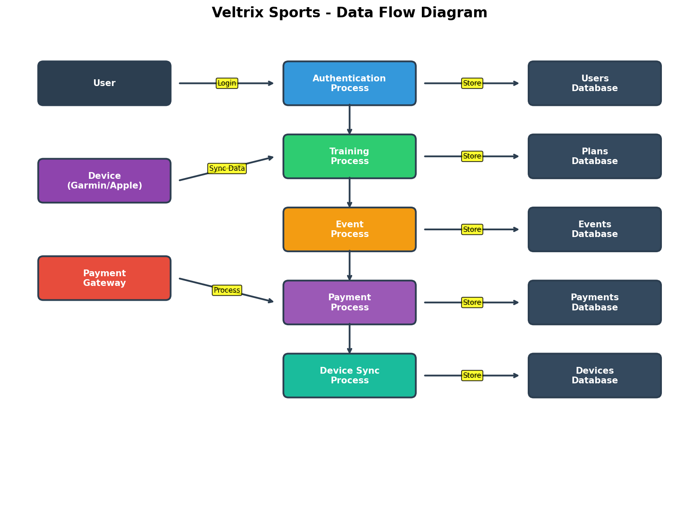

## Description
Shows how data moves through the system:
- **External Entities**: User, Device, Payment Gateway
- **Processes**: Authentication, Training, Event, Payment, Device Sync
- **Data Stores**: Users, Plans, Events, Payments, Devices databases

## Data Movement
| From | To | Data |
|------|-----|------|
| User | Auth Process | Credentials |
| Device | Training Process | Activity Data |
| Payment Gateway | Payment Process | Transaction Data |
| Processes | Databases | Stored Data |

---

# 12. DEPLOYMENT ARCHITECTURE

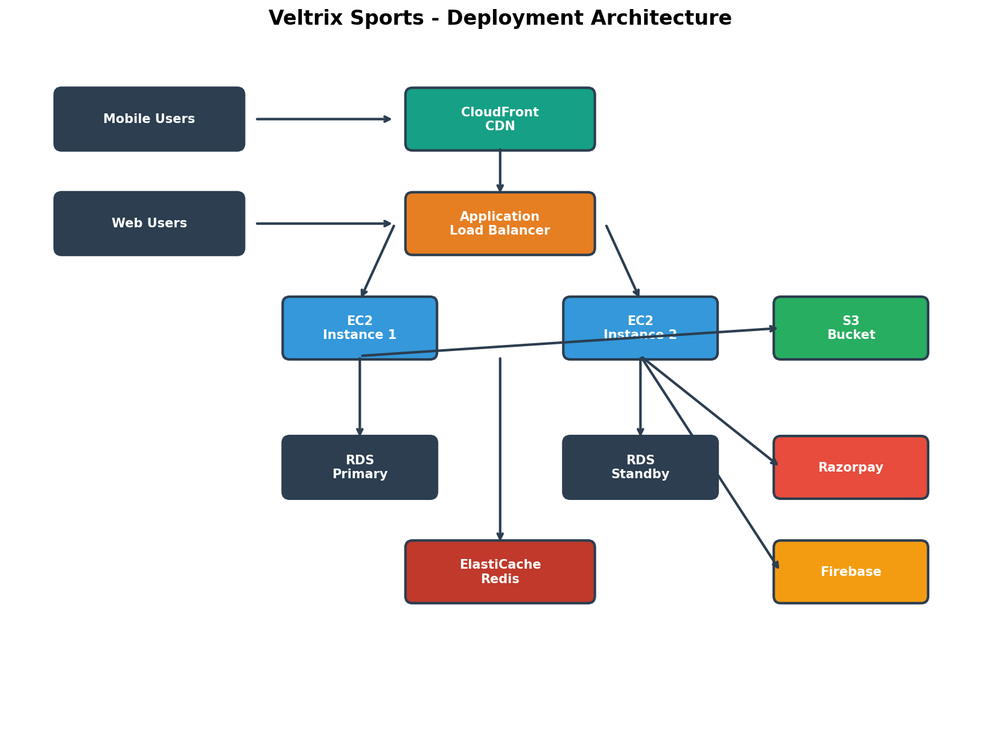

## Description
Shows AWS deployment setup:
- **Users**: Mobile & Web
- **CDN**: CloudFront
- **Load Balancer**: Application Load Balancer
- **Compute**: EC2 Instances (2)
- **Database**: RDS Primary + Standby
- **Cache**: ElastiCache Redis
- **Storage**: S3 Bucket
- **External**: Razorpay, Firebase

## AWS Services
| Service | Purpose | Configuration |
|---------|---------|---------------|
| CloudFront | CDN | Global edge locations |
| ALB | Load Balancing | Multi-AZ |
| EC2 | Compute | t3.small × 2 |
| RDS | Database | PostgreSQL, Multi-AZ |
| ElastiCache | Caching | Redis |
| S3 | Storage | Encrypted |
| Razorpay | Payments | PCI Compliant |
| Firebase | Notifications | FCM |

---

# GENERATING DIAGRAMS

## Prerequisites
```bash
pip install matplotlib pillow
```

## Generate All Diagrams
```bash
cd diagrams
python create_diagrams.py
```

## Output
All diagrams are saved as PNG files in the `diagrams/` folder.

---

**Last Updated**: August 29, 2026
